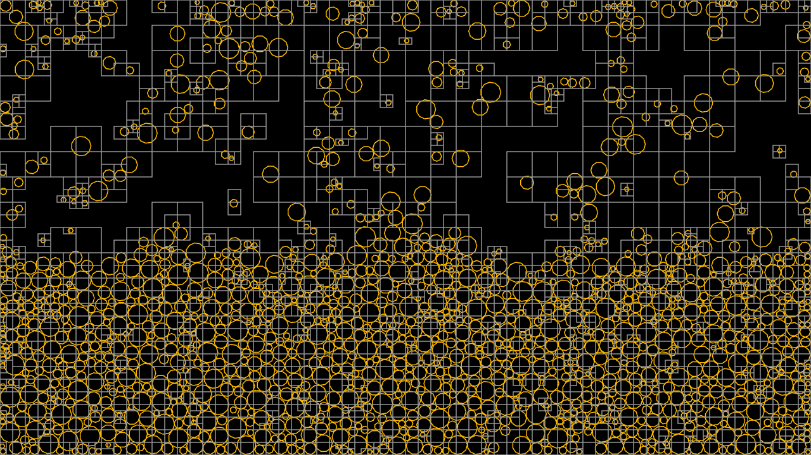

# broadphase-rs



## Overview

broadphase-rs is a, creatively named, broadphase collision detection library in Rust.  It transforms object bounds
into a lightweight spatial index representation, a single integer.  This index can be sorted directly to produce a
topological ordering, after which full-system collision detection is accomplished by a single pass over the sorted
list with only a minimal auxiliary stack necessary to maintain state.  Collision tests between indices are accomplished
with simple bitwise shifts, masks, and XORs.

## Usage

From the included example:

```Rust
struct Collisions {
    system: broadphase::Layer<broadphase::Index64_3D, specs::world::Index, Point3<u32>>,
    collisions: Vec<(specs::Entity, specs::Entity, f32, Vector2<f32>)>,
}

// ...

self.system.clear();
self.system.extend(collision_config.bounds,
    (&entities, &positions, &radii).join()
        .map(|(ent, &pos, &Radius(r))| {
            let bounds = Bounds{
                min: Point3::new(pos.1.x - r, pos.1.y - r, 0.0f32),
                max: Point3::new(pos.1.x + r, pos.1.y + r, 0.0f32)};
            (bounds, ent.id())}));

self.collisions = self.system.detect_collisions()
```